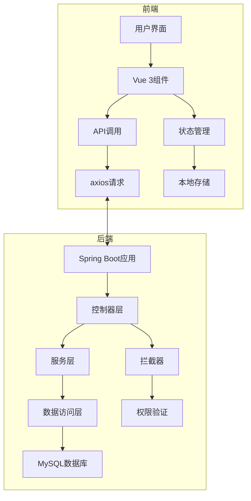
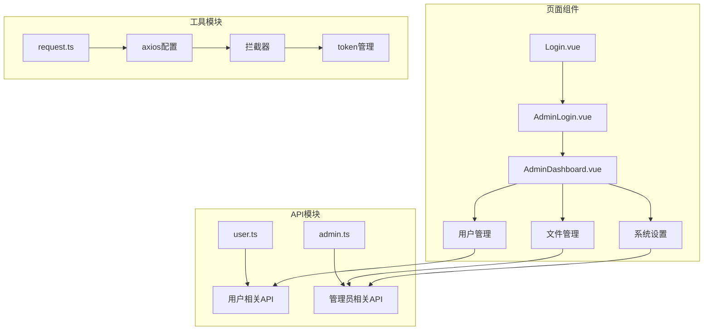
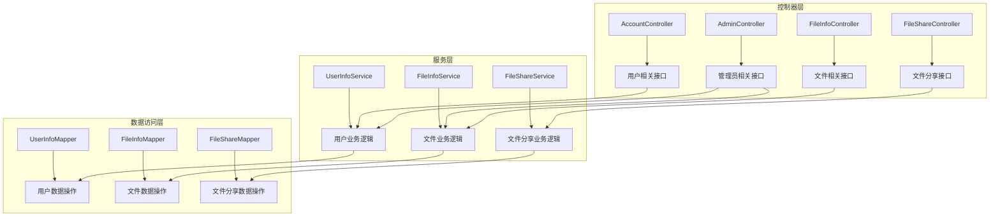
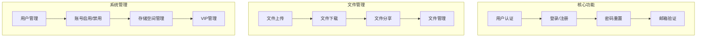

# Easy云盘项目架构

## 系统架构

## 前端架构

## 后端架构

## 功能模块

## 技术栈

| 分类 | 技术 | 版本 |
|------|------|------|
| 前端 | Vue 3 | 3.x |
| 前端 | TypeScript | 4.x+ |
| 前端 | Element Plus | 2.x |
| 前端 | Axios | 1.x |
| 后端 | Spring Boot | 3.x |
| 后端 | MyBatis-Plus | 3.x |
| 后端 | MySQL | 8.x |
| 后端 | Redis | 7.x |
